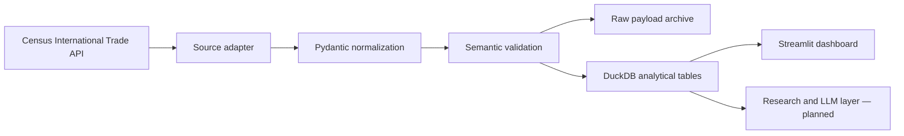

# PortWatch

PortWatch is an alternative-data pipeline and research dashboard for monitoring U.S. port
conditions and industrial trade flows. It combines validated public data with explicit
provenance so an analyst can separate observed cargo movements from inferred public-company
exposure.

> **Project status:** early MVP. The first vertical slice ingests monthly Census imports by
> port, Harmonized System commodity, and origin country into an auditable DuckDB store.

## Why this exists

Traditional macro releases describe trade at a high level. PortWatch is designed to answer
more specific research questions:

- What industrial goods are moving through a port?
- Which origin countries drive the change?
- Is containerized value or weight accelerating or declining?
- Are port operating conditions consistent with the trade signal?
- Which covered companies may be exposed, and what evidence supports that inference?

PortWatch never presents an inferred company exposure as observed shipment ownership.

## Current architecture



The ingestion path includes bounded retries for transient network errors, request timeouts,
source-specific validation, idempotent upserts, raw response hashing, and success/failure run
history.

See [the architecture notes](docs/architecture.md) for component boundaries and planned
extensions.

## Data grain

The normalized `trade_flows` table is monthly:

```text
month × U.S. port × HS commodity × origin country × source
```

Measures currently include total import value, vessel value and weight, and containerized
vessel value and weight. The source is the official
[Census International Trade API](https://www.census.gov/data/developers/data-sets/international-trade.html).

## Quick start

Prerequisites:

- Python 3.12 or newer
- A free [Census API key](https://api.census.gov/data/key_signup.html)

```bash
python -m venv .venv
source .venv/bin/activate  # Windows PowerShell: .venv\Scripts\Activate.ps1
python -m pip install -e ".[dev]"
cp .env.example .env       # Windows PowerShell: Copy-Item .env.example .env
```

Add the Census key to `.env`, then initialize the database:

```bash
portwatch init-db
```

Ingest industrial machinery for Los Angeles and Long Beach for one month:

```bash
portwatch ingest census --month 2026-05 --port 2704 --commodity 84
portwatch ingest census --month 2026-05 --port 2709 --commodity 84
```

Launch the dashboard:

```bash
portwatch dashboard
```

Schedule D port codes used in the initial scope:

| Port | Code |
|---|---:|
| Los Angeles, CA | `2704` |
| Long Beach, CA | `2709` |

## Development

```bash
ruff check .
ruff format --check .
pytest --cov=portwatch --cov-report=term-missing
mypy src/portwatch
```

Tests use source-shaped fixtures and mocked HTTP transports. They do not call live services or
require credentials.

## Roadmap

- [x] Typed Census port/HS ingestion adapter
- [x] Semantic data contracts and ingestion audit table
- [x] Idempotent DuckDB storage and dashboard shell
- [ ] Backfill orchestration for the Industrials HS universe
- [ ] Port of Los Angeles and Long Beach operating-report adapters
- [ ] Commodity momentum and concentration signals
- [ ] Evidence-backed public-company exposure registry
- [ ] Grounded research copilot with citations
- [ ] Containerized deployment and scheduled ingestion

## Data and research limitations

Census data identify commodity, country, port, value, weight, and mode—not the beneficial cargo
owner. Carrier schedules and aggregate port reports cannot be safely joined to a commodity flow
as if they were shipment-level bills of lading. Any later company exposure model will therefore
be labeled as inferred unless a licensed shipment-level source supports the attribution.

This project is for research and education and is not investment advice.

## License

MIT
