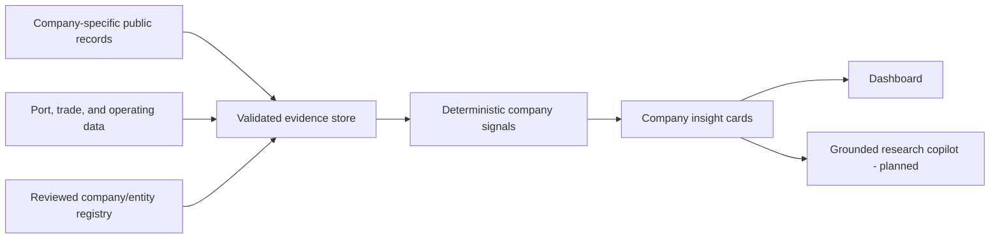

# PortWatch

PortWatch is a company-centered alternative-data research system for Industrials equities.
It combines company-specific public records with port, trade, and operating data to produce
dated, evidence-backed company insight cards. Explicit provenance separates observed company
events from contextual cargo movements and inferred public-company exposure.

> **Primary objective:** discover differentiated, micro/company-level changes that can update an
> investment thesis. Port and trade aggregates are supporting evidence, not the final product.

> **Project status:** v0.3 company-evidence foundation. The vintage-aware port/trade pipeline,
> dated entity graph, SEC submissions and Company Facts ingestion, and inferred exposure layer are
> implemented. Evidence-gated company insight cards are the next product milestone.

## Why this exists

Traditional macro releases describe trade at a high level. PortWatch is designed to answer
company-relevant research questions:

- What changed for a covered company before it appeared clearly in reported financials?
- Is the change directly observed in a company-linked source or inferred from its exposures?
- Which products, facilities, customers, contracts, or origin countries explain the change?
- Do port and operating conditions corroborate or contradict the company signal?
- What is the confidence, freshness, counterevidence, and investment-thesis implication?

PortWatch never presents an inferred company exposure as observed shipment ownership.
No company score should be considered research-ready unless it includes at least one
company-specific evidence source in addition to contextual port/trade data.

## Target research architecture


```mermaid
flowchart LR
    A["Company-specific public records"] --> D["Validated evidence store"]
    B["Port, trade, and operating data"] --> D
    C["Reviewed company/entity registry"] --> D
    D --> E["Deterministic company signals"]
    E --> F["Company insight cards"]
    F --> G["Dashboard"]
    F --> H["Grounded research copilot - planned"]
```

The ingestion path includes bounded retries for transient network errors, request timeouts,
source-specific validation, resumable configuration-driven backfills, raw response hashing,
revision history, and success/failure run audits.

See [the company insight strategy](docs/company-insight-strategy.md),
[project structure](docs/project-structure.md), [data model](docs/data-model.md), and
[architecture notes](docs/architecture.md) for component boundaries and research semantics.

## Data grain

The normalized `trade_flows` table is monthly:

```text
month × U.S. port × HS commodity × origin country × source
```

Measures currently include total import value, vessel value and weight, and containerized
vessel value and weight. The source is the official
[Census International Trade API](https://www.census.gov/data/developers/data-sets/international-trade.html).

## Quick start

Prerequisites:

- Python 3.12 or newer
- A free [Census API key](https://api.census.gov/data/key_signup.html)

```bash
python -m venv .venv
source .venv/bin/activate  # Windows PowerShell: .venv\Scripts\Activate.ps1
python -m pip install -e ".[dev]"
cp .env.example .env       # Windows PowerShell: Copy-Item .env.example .env
```

Add the Census key to `.env`, then initialize the database:

```bash
portwatch init-db
```

Ingest industrial machinery for Los Angeles and Long Beach for one month:

```bash
portwatch ingest census --month 2026-05 --port 2704 --commodity 84
portwatch ingest census --month 2026-05 --port 2709 --commodity 84
```

Launch the dashboard:

```bash
portwatch dashboard
```

Run the full configured backfill and latest Port of Los Angeles release:

```bash
portwatch backfill --config config/portwatch.yml
portwatch ingest port-la
```

Ingest SEC submissions and structured Company Facts for a reviewed registry issuer:

```bash
# PORTWATCH_USER_AGENT must include a real contact email for SEC fair-access compliance.
portwatch ingest sec --ticker CAT
```

The adapter archives each complete SEC response for reproducibility and normalizes the most
recent five filing years by default to keep local research runs fast and memory-bounded. Adjust
`PORTWATCH_SEC_FACT_HISTORY_YEARS` in `.env` when a longer analytical history is required.

Schedule D port codes used in the initial scope:

| Port | Code |
|---|---:|
| Los Angeles, CA | `2704` |
| Long Beach, CA | `2709` |

## Development

```bash
ruff check .
ruff format --check .
pytest --cov=portwatch --cov-report=term-missing
mypy src/portwatch
```

Tests use source-shaped fixtures and mocked HTTP transports. They do not call live services or
require credentials.

## Roadmap

- [x] Typed Census port/HS ingestion adapter
- [x] Semantic data contracts and ingestion audit table
- [x] Idempotent DuckDB storage and dashboard shell
- [x] Resumable backfill orchestration for the Industrials HS universe
- [x] Publication-aware current values and complete revision history
- [x] Port of Los Angeles monthly public container-statistics adapter
- [x] Commodity momentum, concentration, z-score, and unit-value signals
- [x] Evidence-backed public-company exposure registry structure
- [x] Dated company/subsidiary/facility entity graph with reviewed identifiers
- [ ] Source-specific automated entity matching with analyst approval
- [x] Company-specific SEC filing and structured-fact adapter
- [ ] Company-level federal award adapter for relevant Industrials issuers
- [ ] Facility event adapters for OSHA and EPA public records
- [ ] Evidence-gated company insight cards with confidence and counterevidence
- [ ] Daily dwell, vessel, rail, and blank-sailing adapters
- [ ] Long Beach public operating-report adapter
- [ ] Grounded company research copilot with source citations
- [ ] Containerized deployment and scheduled ingestion

## Data and research limitations

Census data identify commodity, country, port, value, weight, and mode—not the beneficial cargo
owner. Carrier schedules and aggregate port reports cannot be safely joined to a commodity flow
as if they were shipment-level bills of lading. Any later company exposure model will therefore
be labeled as inferred unless a licensed shipment-level source supports the attribution.

This project is for research and education and is not investment advice.

## License

MIT
