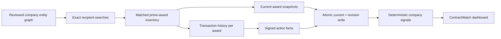

# ContractWatch research guide

ContractWatch converts public federal procurement records into company-linked evidence for an
Industrials investment workflow. Its useful signal is not “this company has government exposure.”
It is the dated change in funding, deobligations, program mix, and renewal risk for legal entities
that have been reviewed in the company registry.

## Research questions

The dashboard is designed to support questions such as:

- Is federal funding to a company accelerating or decelerating versus the prior year?
- Are headline gross awards being offset by cancellations or deobligations?
- Which agency, industry code, or product/service code is driving the change?
- Is a funding change concentrated in one large modification or broad across programs?
- Which material awards approach the end of their reported performance period?
- Does contract activity corroborate hiring, facility, SEC filing, or management-guidance evidence?

These are thesis inputs, not standalone buy or sell signals.

## Pipeline



The source adapter uses the public
[USAspending API](https://api.usaspending.gov/docs/endpoints). It archives every request and exact
response page before normalized observations are committed. Award search is bounded and
rate-limited. Each matched award then uses the official
[transaction endpoint](https://github.com/fedspendingtransparency/usaspending-api/blob/master/usaspending_api/api_contracts/contracts/v2/transactions.md)
to collect dated actions. Pagination fails closed when a configured page ceiling would truncate a
result set.

## Economic semantics

| Field | Interpretation | Do not call it |
|---|---|---|
| Current award obligations | Cumulative obligations in the latest award snapshot | Revenue, backlog, ceiling, or remaining value |
| Positive transaction | Federal obligations added on an action date | Recognized revenue or cash received |
| Negative transaction | Deobligation on an action date | Necessarily a cancellation or earnings loss |
| Period-of-performance end | Reported award end date | Certain renewal or revenue cliff |
| NAICS / PSC | Government classification of the award | Company reporting segment without review |

Transaction flow is the preferred series for momentum. Current award inventory is retained for
cross-checking, concentration, and expiration analysis. A gap between cumulative award obligations
and the sum of downloaded actions is surfaced through award-level reconciliation and transaction
coverage rather than silently filled.

## Company attribution

ContractWatch never accepts a fuzzy search result as company evidence. A result must resolve by:

1. reviewed UEI;
2. reviewed USAspending recipient identifier; or
3. exact punctuation-insensitive legal name or alias active on the award date.

The entity graph may include the issuer and operating or finance subsidiaries. This matters because
federal awards often name a legal subsidiary rather than the listed parent. Unresolved candidates
remain in the immutable raw archive and contribute to the rejected-record audit count.

## Signals and drilldowns

The dashboard separates two panels:

- **Funding momentum:** TTM net and gross obligations, deobligations, modifications, YoY change,
  action coverage, and monthly signed flow.
- **Award inventory:** current cumulative obligations, matched award count, agency concentration,
  performance-period expirations, and award-level reconciliation.

Agency, NAICS, and PSC views attribute transaction actions through the stable parent award. Latest
actions retain the action type, modification number, description, revision number, and direct
USAspending evidence link so an analyst can verify any large move.

## Operations

```bash
# Create or migrate the transaction and revision tables.
portwatch init-db

# Search the trailing three years and collect full histories for matched awards.
portwatch ingest contracts --ticker CAT

# Use an explicit award-search window.
portwatch ingest contracts --ticker CAT --start 2024-10-01 --end 2026-08-07

# Inspect the result.
portwatch audit contracts
portwatch dashboard
```

The transaction endpoint supports up to 5,000 actions per page. Operational limits are explicit in
`.env`:

```dotenv
PORTWATCH_USASPENDING_REQUEST_INTERVAL_SECONDS=0.25
PORTWATCH_USASPENDING_PAGE_SIZE=100
PORTWATCH_USASPENDING_MAX_PAGES_PER_SEARCH=100
PORTWATCH_USASPENDING_TRANSACTION_PAGE_SIZE=5000
PORTWATCH_USASPENDING_MAX_TRANSACTION_PAGES_PER_AWARD=10
```

If an existing database contains award snapshots but no transaction rows, re-run the company
ingestion. Schema initialization creates the new tables, but only a source refresh can backfill the
action history.

## Investment-use limitations

- Federal obligations can lead, coincide with, or lag company revenue depending on delivery and
  accounting terms.
- Deobligations can reflect administrative closeout, scope change, underrun, or cancellation; read
  the action and award evidence before assigning a thesis interpretation.
- USAspending data can be revised. Use `available_at`, revision tables, and raw hashes for
  point-in-time work.
- Prime awards exclude subawards and the initial scope excludes indefinite-delivery vehicles whose
  potential amounts have different meanings.
- Recipient resolution can miss unregistered subsidiaries. Extend the dated entity graph with
  cited legal names and identifiers instead of weakening the matcher.
- NAICS and PSC are government award classifications. Mapping them to company segments requires a
  separate reviewed taxonomy.

The strongest pitch use combines a material ContractWatch inflection with independent evidence,
such as targeted hiring, a facility event, a disclosed segment exposure, or an SEC filing.
