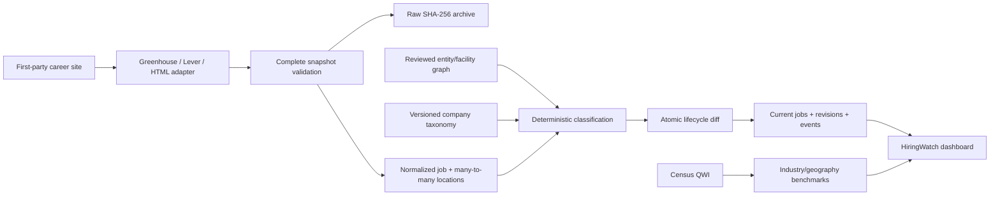

# HiringWatch design and company onboarding

HiringWatch turns public first-party career postings into a repeatable company-level labor-demand
dataset. It is designed for Industrials research, but its adapters and schema are sector-agnostic.
Company-specific URLs, selectors, taxonomies, and NAICS mappings are versioned configuration.

## Research questions

The micro layer answers:

- Where is a company adding or withdrawing advertised labor demand?
- Which reported business line, function, facility, and strategic theme explains the change?
- Are openings broad-based or concentrated in a small geography or role family?
- Are autonomy, electrification, aftermarket, manufacturing, or capacity-related roles changing?
- How long do postings remain open, and which roles reopen after disappearing?

The macro layer answers whether those changes coincide with official employment, hire,
separation, job-gain/loss, earnings, and payroll conditions for a relevant geography and NAICS
industry. Company postings and Census QWI are displayed separately because they have different
economic meanings and publication lags.

## Data flow



The dashboard never scrapes a site. Collection, parsing, classification, raw archiving, and the
database diff happen in the CLI ingestion process.

## Supported career-source types

| Type | Best use | Pagination completeness |
|---|---|---|
| `greenhouse` | Companies using the public [Greenhouse Job Board API](https://developers.greenhouse.io/job-board.html) | One documented public feed |
| `lever` | Companies using [Lever's public Postings API](https://github.com/lever/postings-api) | `skip`/`limit` until a short final page |
| `html_paginated` | First-party sites with stable server-rendered job cards | Reads the reported last page and fails closed on inconsistency |

Aggregators such as LinkedIn and Indeed are intentionally excluded. First-party sources make the
evidence link clearer and reduce terms-of-use and attribution ambiguity.

HTML listings often expose only title, requisition ID, URL, and location. When
`detail_json_ld: true`, HiringWatch reads the standard schema.org `JobPosting` object from a bounded
number of detail pages, archives it, and extracts description, career area, employment type, and
posting date. Existing detail fields are reused from DuckDB and refreshed after
`detail_cache_ttl_days`; new, stale, or still-unenriched jobs enter the next run's bounded queue.
`detail_fetch_limit_per_run` controls the daily budget, and `--detail-limit` provides an operator
override for an initial backfill. All pages from one source run are archived in one transaction,
while payload deduplication retains a separate provenance link for every page URL.

## Add another company

1. Add the issuer, active ticker/CIK, subsidiaries, and reviewed facilities to
   `config/company_exposures.yml` with dated evidence.
2. Add an enabled source to `config/hiringwatch.yml`. Use a stable Greenhouse board token, Lever
   site name, or CSS selectors from the company's own career page.
3. Add reported business-line rules with effective dates, an SEC evidence URL, and relevant NAICS
   codes. Add function and strategic-theme keyword rules.
4. Validate configuration and the CLI without making a network call:

   ```bash
   portwatch ingest hiring --help
   pytest tests/test_hiring.py
   ```

5. Run one source and inspect classification coverage and unresolved facilities:

   ```bash
   portwatch ingest hiring --source company_careers_id
   portwatch ingest hiring --source company_careers_id --detail-limit 250
   portwatch dashboard
   ```

Greenhouse example:

```yaml
- source_id: example_greenhouse
  ticker: EXM
  entity_id: example_inc
  source_type: greenhouse
  base_url: https://www.example.com/careers/
  api_identifier: example-board-token
  enabled: true
```

Lever example:

```yaml
- source_id: example_lever
  ticker: EXM
  entity_id: example_inc
  source_type: lever
  base_url: https://jobs.lever.co/example/
  api_identifier: example-site-name
  page_size: 100
  enabled: true
```

The source `entity_id` must be active and reachable from the ticker's reviewed issuer graph. This
prevents a copied career URL from silently writing jobs to the wrong company.

## Lifecycle rules

- Every job in a source's first complete snapshot emits `baseline` and revision 1. Baselines seed
  coverage without falsely claiming that every listing opened on the collector's start date.
- A new source/job ID observed after that baseline emits `opened` and revision 1.
- Changed normalized content emits `updated` and a new revision.
- One complete snapshot miss increments `missing_snapshot_count` but does not close the job.
- The second consecutive complete miss emits `closed` by default.
- A closed ID that returns emits `reopened` and a new revision.
- A network, parsing, unexpected empty-page, or page-limit failure records a failed run
  and cannot change job lifecycle state.
- Current rows, prior-revision closure, new revisions, location rows, and events share one DuckDB
  transaction.

## Classification policy

Classification is deliberately explainable. Keyword hit counts select a unique reported business
line and function; ties remain unclassified. Themes are multi-label. Seniority uses title rules.
Facility linkage requires a unique reviewed facility locality match. The output stores method,
confidence, and configuration version so changes are auditable.

An LLM may later propose classifications for the unclassified queue, but it should not overwrite
these fields automatically. Accepted mappings should be analyst-reviewed, versioned, and cited.

## Operating schedule

Run career sources daily at a consistent UTC time. Run QWI quarterly for every company-relevant
NAICS/geography pair after new vintages become available. Monitor `ingestion_runs` and alert on
failures, material drops in source job counts, classification coverage deterioration, and site
pagination changes.

The repository includes `.github/workflows/hiringwatch-daily.yml`, scheduled for 12:17 UTC. Each
run restores the DuckDB artifact from the last successful run, ingests every enabled career source,
runs `portwatch audit hiring`, and uploads the validated state for the next run. This state handoff
is essential: starting with an empty GitHub runner each day would turn every observation into a new
baseline and destroy lifecycle history.

The first successful run creates the baseline. Later runs fail closed if a prior successful state
exists but its artifact cannot be restored. A manual workflow dispatch supports a ticker filter,
detail-page limit, and an explicit `reset_state` switch. Resetting is destructive to historical
continuity and should only be used intentionally. Artifacts are retained for 30 days; for an
always-on deployment with longer recovery requirements, point `PORTWATCH_DATABASE_PATH` at a
state volume backed up to durable object storage.

After any scheduled or local ingestion, validate the stored state with:

```bash
portwatch audit hiring
```

History starts when the collector starts. The current implementation does not fabricate historical
postings from search-engine caches, and it cannot determine whether a closed posting was filled,
cancelled, duplicated, or moved to a new requisition ID.
