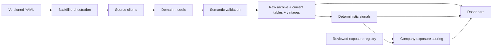

# Project structure

PortWatch is organized around source adapters, immutable domain models, orchestration services,
and deterministic research analytics. The dashboard does not call upstream sources directly.

```text
FinanceTools/
├── config/
│   ├── portwatch.yml                 # Backfill universe and execution policy
│   └── company_exposures.yml         # Reviewed company/HS mappings and evidence
├── docs/
│   ├── architecture.md               # Component boundaries and design decisions
│   ├── data-model.md                 # Grains, vintages, and signal definitions
│   └── project-structure.md           # This file
├── src/portwatch/
│   ├── analytics/
│   │   └── signals.py                # YoY, momentum, z-score, HHI, unit value
│   ├── dashboard/
│   │   └── app.py                    # Read-only Streamlit research interface
│   ├── ingestion/
│   │   ├── census.py                 # Census port/HS API adapter
│   │   └── port_of_la.py             # Port of LA public HTML adapter
│   ├── storage/
│   │   └── duckdb.py                 # Current tables, vintages, audit history
│   ├── backfill.py                   # Resumable Cartesian backfill orchestration
│   ├── cli.py                        # Operator commands
│   ├── config.py                     # Environment/secrets configuration
│   ├── models.py                     # Validated domain and exposure models
│   ├── port_service.py               # Port-operation ingestion transaction
│   ├── project_config.py             # Versioned YAML project configuration
│   ├── registry.py                   # Exposure loading and scoring
│   ├── service.py                    # Census ingestion transaction
│   └── validation.py                 # Cross-record semantic contracts
└── tests/
    ├── fixtures/                     # Source-shaped, offline test responses
    └── test_*.py                     # Unit and integration tests
```

## Dependency direction



Source adapters know HTTP and source schemas. They do not calculate investment signals.
Analytics consume only normalized observations. The company registry cannot convert aggregate
trade data into importer ownership; it creates an explicitly inferred economic mapping.

## Operational commands

```bash
# Create or migrate DuckDB tables
portwatch init-db

# Ingest one Census slice
portwatch ingest census --month 2026-05 --port 2704 --commodity 84

# Run the configured, resumable industrial backfill
portwatch backfill --config config/portwatch.yml

# Re-request even successful slices to detect source revisions
portwatch backfill --config config/portwatch.yml --force

# Ingest the latest Port of Los Angeles monthly TEU release
portwatch ingest port-la

# Launch research dashboard
portwatch dashboard
```

## Extension points

- Add a source in `ingestion/`, a normalized model in `models.py`, and a transactional service.
- Add new ports and HS themes in `config/portwatch.yml`; orchestration code does not change.
- Add a reviewed company in `config/company_exposures.yml` with evidence and limitations.
- Add daily dwell, vessel, rail, or blank-sailing metrics as new `PortMetricName` values without
  mixing them into the monthly Census trade-flow grain.

